# Workflow Design Document
## ArtiCurated Order Management System

---

**Version:** 1.0  
**Last Updated:** December 2024  
**Document Owner:** Lead Software Engineer  
**Status:** Active

---

## Table of Contents

1. [State Machine Diagrams](#1-state-machine-diagrams)
2. [Database Schema](#2-database-schema)
3. [Sequence Diagrams](#3-sequence-diagrams)
4. [Data Flow Architecture](#4-data-flow-architecture)
5. [Background Job Workflows](#5-background-job-workflows)

---

## 1. State Machine Diagrams

### 1.1 Order State Machine


#### Order State Transition Rules

| Current State | Allowed Next States | Trigger | Business Rules |
|--------------|---------------------|---------|----------------|
| `PENDING_PAYMENT` | `PAID`, `CANCELLED` | Payment gateway webhook / timeout | Max 24hr before auto-cancel |
| `PAID` | `PROCESSING_IN_WAREHOUSE`, `CANCELLED` | Warehouse assignment / Customer request | Refund if cancelled |
| `PROCESSING_IN_WAREHOUSE` | `SHIPPED` | Shipping confirmation | Cannot cancel after this point |
| `SHIPPED` | `DELIVERED` | Carrier delivery confirmation | Invoice generation triggered |
| `DELIVERED` | *(Terminal)* | N/A | Return eligible for 30 days |
| `CANCELLED` | *(Terminal)* | N/A | No further transitions |

#### Invalid Transitions (Explicitly Rejected)

- ❌ `SHIPPED` → `PAID` (No reverse transitions)
- ❌ `DELIVERED` → `PROCESSING_IN_WAREHOUSE`
- ❌ `CANCELLED` → Any state (terminal)
- ❌ Any state → `PENDING_PAYMENT` (initial state only)

---

### 1.2 Return State Machine


#### Return State Transition Rules

| Current State | Allowed Next States | Trigger | Business Rules |
|--------------|---------------------|---------|----------------|
| `REQUESTED` | `APPROVED`, `REJECTED` | Manager decision | Manager notes required |
| `APPROVED` | `IN_TRANSIT` | Customer ships item | Return label provided |
| `REJECTED` | *(Terminal)* | N/A | Reason categorized |
| `IN_TRANSIT` | `RECEIVED` | Warehouse scan | Item inspection |
| `RECEIVED` | `COMPLETED` | Quality check passed | Refund processing triggered |
| `COMPLETED` | *(Terminal)* | N/A | Refund confirmed |

#### Return Eligibility Rules

```
IF order.status == "DELIVERED"
   AND (current_date - order.delivered_at) <= 30 days
   AND order.has_return == False
THEN
   return_eligible = True
ELSE
   return_eligible = False
   error_code = "RETURN_NOT_ALLOWED"
```

---

## 2. Database Schema

### 2.1 Entity Relationship Diagram


### 2.2 Table Definitions

#### `orders` Table

```sql
CREATE TYPE order_status AS ENUM (
    'PENDING_PAYMENT',
    'PAID',
    'PROCESSING_IN_WAREHOUSE',
    'SHIPPED',
    'DELIVERED',
    'CANCELLED'
);

CREATE TABLE orders (
    id UUID PRIMARY KEY DEFAULT gen_random_uuid(),
    customer_id UUID NOT NULL,
    order_number VARCHAR(50) UNIQUE NOT NULL,
    status order_status NOT NULL DEFAULT 'PENDING_PAYMENT',
    total_amount NUMERIC(10, 2) NOT NULL,
    currency VARCHAR(3) NOT NULL DEFAULT 'USD',
    payment_method VARCHAR(50),
    payment_transaction_id VARCHAR(100),
    shipping_address JSONB NOT NULL,
    billing_address JSONB NOT NULL,
    created_at TIMESTAMP NOT NULL DEFAULT CURRENT_TIMESTAMP,
    updated_at TIMESTAMP NOT NULL DEFAULT CURRENT_TIMESTAMP,
    cancelled_at TIMESTAMP,
    cancellation_reason TEXT,
    
    CONSTRAINT positive_amount CHECK (total_amount > 0)
);

-- Indexes for performance
CREATE INDEX idx_orders_customer_id ON orders(customer_id);
CREATE INDEX idx_orders_status ON orders(status);
CREATE INDEX idx_orders_created_at ON orders(created_at DESC);
CREATE INDEX idx_orders_order_number ON orders(order_number);
```

#### `order_line_items` Table

```sql
CREATE TABLE order_line_items (
    id UUID PRIMARY KEY DEFAULT gen_random_uuid(),
    order_id UUID NOT NULL REFERENCES orders(id) ON DELETE CASCADE,
    product_id UUID NOT NULL,
    product_name VARCHAR(255) NOT NULL,
    quantity INTEGER NOT NULL,
    unit_price NUMERIC(10, 2) NOT NULL,
    subtotal NUMERIC(10, 2) NOT NULL,
    created_at TIMESTAMP NOT NULL DEFAULT CURRENT_TIMESTAMP,
    
    CONSTRAINT positive_quantity CHECK (quantity > 0),
    CONSTRAINT positive_price CHECK (unit_price >= 0),
    CONSTRAINT valid_subtotal CHECK (subtotal = quantity * unit_price)
);

CREATE INDEX idx_order_line_items_order_id ON order_line_items(order_id);
```

#### `return_requests` Table

```sql
CREATE TYPE return_status AS ENUM (
    'REQUESTED',
    'APPROVED',
    'REJECTED',
    'IN_TRANSIT',
    'RECEIVED',
    'COMPLETED'
);

CREATE TABLE return_requests (
    id UUID PRIMARY KEY DEFAULT gen_random_uuid(),
    order_id UUID UNIQUE NOT NULL REFERENCES orders(id) ON DELETE CASCADE,
    status return_status NOT NULL DEFAULT 'REQUESTED',
    reason TEXT NOT NULL,
    customer_notes TEXT,
    manager_notes TEXT,
    rejection_reason VARCHAR(50),
    refund_amount NUMERIC(10, 2) NOT NULL,
    refund_transaction_id VARCHAR(100),
    created_at TIMESTAMP NOT NULL DEFAULT CURRENT_TIMESTAMP,
    updated_at TIMESTAMP NOT NULL DEFAULT CURRENT_TIMESTAMP,
    approved_at TIMESTAMP,
    rejected_at TIMESTAMP,
    completed_at TIMESTAMP,
    
    CONSTRAINT positive_refund CHECK (refund_amount > 0)
);

CREATE INDEX idx_return_requests_status ON return_requests(status);
CREATE INDEX idx_return_requests_created_at ON return_requests(created_at DESC);
```

#### `state_history` Table (Audit Trail)

```sql
CREATE TYPE entity_type_enum AS ENUM ('ORDER', 'RETURN');
CREATE TYPE actor_type_enum AS ENUM ('USER', 'SYSTEM');

CREATE TABLE state_history (
    id UUID PRIMARY KEY DEFAULT gen_random_uuid(),
    entity_type entity_type_enum NOT NULL,
    entity_id UUID NOT NULL,
    previous_state VARCHAR(50) NOT NULL,
    new_state VARCHAR(50) NOT NULL,
    actor_id UUID,
    actor_type actor_type_enum NOT NULL,
    trigger VARCHAR(100) NOT NULL,
    metadata JSONB DEFAULT '{}',
    ip_address VARCHAR(45),
    created_at TIMESTAMP NOT NULL DEFAULT CURRENT_TIMESTAMP
);

-- Critical composite index for efficient audit queries
CREATE INDEX idx_state_history_entity ON state_history(entity_type, entity_id, created_at DESC);
CREATE INDEX idx_state_history_created_at ON state_history(created_at DESC);
CREATE INDEX idx_state_history_actor ON state_history(actor_id) WHERE actor_id IS NOT NULL;
```

### 2.3 Database Constraints & Business Rules

#### Referential Integrity

- `order_line_items.order_id` → `orders.id` (CASCADE DELETE)
- `return_requests.order_id` → `orders.id` (CASCADE DELETE, UNIQUE)
- One order can have **at most one** return request

#### Check Constraints

- All monetary amounts must be positive
- Subtotal = quantity × unit_price
- Order number format: `ORD-YYYY-NNNNNN` (enforced in application)

#### Immutability

- `state_history` table: **NO UPDATE** or **DELETE** operations allowed
- Application-level enforcement: audit records are append-only

---

## 3. Sequence Diagrams

### 3.1 Complete Order Lifecycle

```mermaid
sequenceDiagram
    participant C as Customer
    participant API as FastAPI Server
    participant DB as PostgreSQL
    participant SM as State Machine
    participant Q as Redis Queue
    participant W as Celery Worker
    participant PG as Payment Gateway
    participant Email as Email Service
    participant Store as Blob Storage
    
    C->>API: POST /api/v1/orders
    API->>DB: Insert order (PENDING_PAYMENT)
    API->>DB: Insert audit record
    API-->>C: 201 Created
    
    Note over C,PG: Payment Processing
    PG->>API: Webhook: Payment Confirmed
    API->>SM: Validate PENDING_PAYMENT → PAID
    SM-->>API: Transition allowed
    API->>DB: Update order.status = PAID
    API->>DB: Insert audit record
    API->>Email: Send confirmation
    
    Note over API,W: Warehouse Processing
    API->>API: POST /orders/:id/state {PROCESSING_IN_WAREHOUSE}
    API->>SM: Validate transition
    API->>DB: Update status
    API->>DB: Insert audit record
    
    Note over W,Store: Shipment & Invoice
    API->>API: POST /orders/:id/state {SHIPPED}
    API->>SM: Validate transition
    API->>DB: Update status
    API->>DB: Insert audit record
    API->>Q: Publish generate_invoice task
    W->>Q: Pick up task
    W->>DB: Fetch order details
    W->>W: Generate PDF (WeasyPrint)
    W->>Store: Save invoice
    W->>Email: Send with attachment
    W->>DB: Log task completion
    
    Note over API,C: Delivery
    API->>API: POST /orders/:id/state {DELIVERED}
    API->>SM: Validate transition
    API->>DB: Update status
    API->>DB: Insert audit record
    API->>Email: Notify customer
```



### 3.2 Return Workflow with Refund

```mermaid
sequenceDiagram
    participant C as Customer
    participant API as FastAPI Server
    participant DB as PostgreSQL
    participant SM as State Machine
    participant M as Manager
    participant Q as Redis Queue
    participant W as Celery Worker
    participant PG as Payment Gateway
    participant Email as Email Service
    
    Note over C,API: Return Initiation
    C->>API: POST /api/v1/returns
    API->>DB: Check order.status == DELIVERED
    API->>DB: Check return_window <= 30 days
    API->>DB: Insert return (REQUESTED)
    API->>DB: Insert audit record
    API->>Email: Notify manager (pending review)
    API-->>C: 201 Created
    
    Note over M,DB: Manager Review
    M->>API: PATCH /returns/:id/approve
    API->>SM: Validate REQUESTED → APPROVED
    SM-->>API: Transition allowed
    API->>DB: Update return.status = APPROVED
    API->>DB: Insert audit record
    API->>Email: Notify customer (approved)
    
    Note over C,API: Customer Ships Back
    C->>API: PATCH /returns/:id/state {IN_TRANSIT}
    API->>SM: Validate transition
    API->>DB: Update status
    API->>DB: Insert audit record
    
    Note over API,W: Warehouse Receives
    API->>API: PATCH /returns/:id/state {RECEIVED}
    API->>SM: Validate transition
    API->>DB: Update status
    API->>DB: Insert audit record
    
    Note over API,W: Quality Check & Refund
    API->>API: PATCH /returns/:id/state {COMPLETED}
    API->>SM: Validate transition
    API->>DB: Update status
    API->>DB: Insert audit record
    API->>Q: Publish process_refund task
    
    W->>Q: Pick up task
    W->>DB: Fetch return & order details
    W->>PG: Call refund API
    PG-->>W: Refund transaction ID
    W->>DB: Update return.refund_transaction_id
    W->>DB: Insert audit record
    W->>Email: Send refund confirmation
    W->>DB: Log task completion
    
    alt Refund Fails
        PG-->>W: Error
        W->>W: Retry (5x exponential backoff)
        W->>W: Alert on final failure
    end
```



### 3.3 Invalid State Transition Handling


---

## 4. Data Flow Architecture

### 4.1 System Component Interaction


### 4.2 Request Processing Flow

```
1. HTTP Request Arrives
   ↓
2. FastAPI Route Handler
   ├── Authentication (API Key)
   ├── Request Validation (Pydantic)
   └── Extract Dependencies (DB Session)
   ↓
3. Service Layer
   ├── Business Logic Execution
   ├── State Machine Validation
   └── Database Transaction
       ├── Update Entity State
       ├── Insert Audit Record (Immutable)
       └── Commit or Rollback
   ↓
4. Background Job (if applicable)
   ├── Publish to Redis Queue
   └── Return immediately (async)
   ↓
5. HTTP Response
   ├── Serialize to JSON (Pydantic)
   └── Return with Status Code
```

---

## 5. Background Job Workflows

### 5.1 Invoice Generation Workflow


**SLA:** Process within 5 minutes of SHIPPED state  
**Retry Policy:** 3 attempts with exponential backoff (1min, 2min, 4min)  
**Monitoring:** Track via Flower dashboard at http://localhost:5555

### 5.2 Refund Processing Workflow


**SLA:** Process within 2 hours of COMPLETED state  
**Retry Policy:** 5 attempts with exponential backoff (2min, 4min, 8min, 16min, 32min)  
**Critical Alert:** Final failure triggers immediate operations team notification

---

## 6. Design Decisions & Trade-offs

### 6.1 State Machine Design

**Decision:** Explicit state validation with comprehensive rejection logging

**Rationale:**
- Business requirement: Zero invalid state transitions
- Compliance: Complete audit trail of all attempted transitions
- Developer experience: Clear error messages with allowed transitions

**Trade-off:**
- More code complexity vs. data integrity guarantees
- **Chosen:** Data integrity is critical for order management

### 6.2 Audit Trail Implementation

**Decision:** Immutable append-only audit records in dedicated table

**Rationale:**
- Compliance requirement: 7-year retention
- Performance: Separate table avoids bloating order/return tables
- Query efficiency: Composite indexes for fast retrieval

**Trade-off:**
- Additional write operations vs. complete audit history
- **Chosen:** Write overhead acceptable for compliance benefits

### 6.3 Background Job Separation

**Decision:** Separate Celery queues for invoices vs. refunds

**Rationale:**
- Different SLAs (5min vs. 2hrs)
- Different retry policies (3x vs. 5x)
- Priority handling: Critical refunds don't block invoices

**Trade-off:**
- More complex routing vs. better isolation
- **Chosen:** Isolation prevents cascade failures

### 6.4 Database Technology

**Decision:** PostgreSQL with JSONB for flexible metadata

**Rationale:**
- ACID compliance for state machine integrity
- JSONB for addresses/metadata without schema migrations
- Proven at scale, excellent tooling

**Trade-off:**
- PostgreSQL complexity vs. simpler databases
- **Chosen:** Feature set justifies operational overhead

---

## 7. Performance Considerations

### 7.1 Database Indexes

**Critical Indexes:**
- `orders(status)` - Filter by order status (frequently queried)
- `orders(customer_id)` - Customer order history
- `state_history(entity_type, entity_id, created_at)` - Audit trail queries
- `return_requests(status)` - Filter pending returns for managers

**Query Optimization:**
- Use `EXPLAIN ANALYZE` for all API queries
- Target: <50ms database query time (p95)

### 7.2 Connection Pooling

```python
# SQLAlchemy Engine Configuration
engine = create_engine(
    DATABASE_URL,
    pool_size=10,          # Max connections per process
    max_overflow=20,       # Additional connections under load
    pool_pre_ping=True,    # Verify connections before use
    pool_recycle=3600,     # Recycle connections every hour
)
```

### 7.3 Caching Strategy (Future Enhancement)

**Cache Candidates:**
- Order details (TTL: 5 minutes)
- Customer order list (TTL: 1 minute)
- State machine validation rules (TTL: infinite, invalidate on deploy)

**Implementation:** Redis cache with `aiocache` library

---

## 8. Security Architecture

### 8.1 Authentication Flow

```
Client Request
    ↓
API Gateway (FastAPI)
    ↓
Validate API Key (X-API-Key header)
    ↓
Authorize: Check user permissions
    ↓
Execute Request
```

### 8.2 Row-Level Security

```python
# Example: Order update with pessimistic locking
order = db.query(Order)\
    .filter(Order.id == order_id)\
    .with_for_update()\
    .first()

# Prevents concurrent state transitions
```

---

## 9. Monitoring & Observability

### 9.1 Key Metrics

**API Metrics:**
- Request rate (requests/second)
- Response time (p50, p95, p99)
- Error rate (4xx, 5xx)
- State transition success rate

**Background Job Metrics:**
- Task queue depth
- Task processing time
- Retry rate
- Failure rate

**Business Metrics:**
- Orders by status (real-time counts)
- Return approval rate
- Average return processing time
- Invoice generation success rate

### 9.2 Alerts

**Critical:**
- API error rate >5%
- Database connection failures
- Refund task final failure
- Disk space <10%

**Warning:**
- API p95 response time >500ms
- Task queue depth >100
- Invoice generation retry rate >10%

---

## 10. Testing Strategy

### 10.1 State Machine Test Matrix

| Test Case | Current State | Requested State | Expected Result |
|-----------|---------------|-----------------|-----------------|
| Valid: Pending → Paid | PENDING_PAYMENT | PAID | ✅ Success |
| Valid: Paid → Processing | PAID | PROCESSING_IN_WAREHOUSE | ✅ Success |
| Valid: Processing → Shipped | PROCESSING_IN_WAREHOUSE | SHIPPED | ✅ Success + Invoice Job |
| Valid: Shipped → Delivered | SHIPPED | DELIVERED | ✅ Success |
| Valid: Pending → Cancelled | PENDING_PAYMENT | CANCELLED | ✅ Success |
| Invalid: Shipped → Paid | SHIPPED | PAID | ❌ 409 Conflict |
| Invalid: Delivered → Processing | DELIVERED | PROCESSING_IN_WAREHOUSE | ❌ 409 Conflict |
| Invalid: Cancelled → Any | CANCELLED | PAID | ❌ 409 Conflict |

### 10.2 Integration Test Scenarios

1. **Complete Order Lifecycle**
   - Create → Pay → Process → Ship → Deliver
   - Verify 4 audit records created
   - Verify invoice task queued

2. **Order Cancellation with Refund**
   - Create → Pay → Cancel
   - Verify refund initiated
   - Verify audit trail

3. **Complete Return Workflow**
   - Initiate → Approve → Ship → Receive → Complete
   - Verify 5 audit records
   - Verify refund task queued

4. **Invalid Transition Rejection**
   - Attempt invalid transition
   - Verify 409 response with correct format
   - Verify failed attempt logged

---

## Appendix A: Glossary

| Term | Definition |
|------|------------|
| **State Transition** | Change from one state to another in the order/return lifecycle |
| **Audit Trail** | Immutable record of all state changes for compliance |
| **Background Job** | Asynchronous task executed by Celery worker |
| **Idempotency** | Task can be retried safely without duplicate effects |
| **Pessimistic Locking** | Database row lock preventing concurrent modifications |
| **Terminal State** | Final state with no further transitions allowed |

---

## Appendix B: References

- **Business Requirements:** `Updated_PRD.md`
- **Technical Specification:** `TECHNICAL_PRD.md`
- **API Documentation:** `API-SPECIFICATION.yml`
- **AI Development Log:** `CHAT_HISTORY.md`

---

**Document Approval:**

| Role | Name | Date | Signature |
|------|------|------|-----------|
| Lead Software Engineer | [Your Name] | Dec 2024 | ✓ |
| Technical Architect | [Architect] | TBD | |

---

**End of Workflow Design Document**
